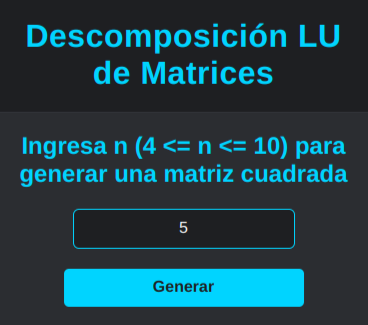
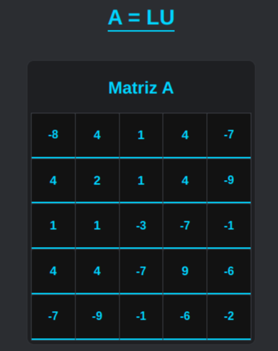
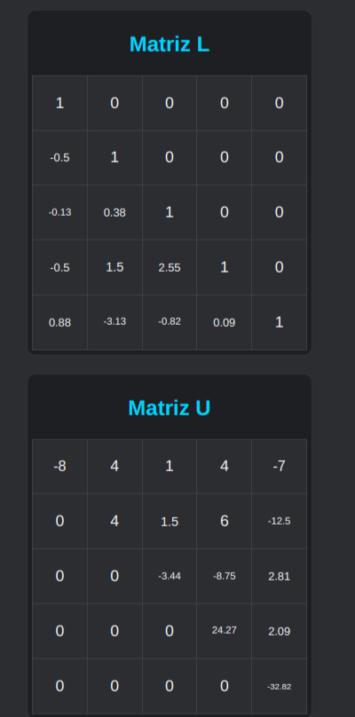
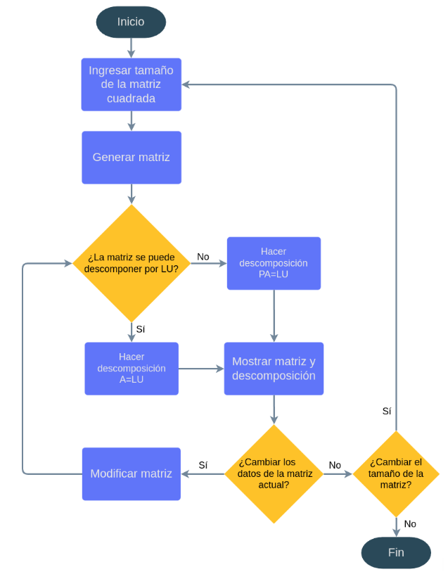

# Descomposición de Matrices

Esta aplicación web realiza la descomposición de matrices cuadradas \( n \times n \) ingresadas por el usuario, eligiendo automáticamente el método más adecuado:

- **Descomposición de Cholesky** (si la matriz es simétrica y positiva definida)  
- **Descomposición LU simple** (si es posible)  
- **Descomposición LU con permutación de filas** (para casos generales)

Está desarrollada con **HTML, CSS y JavaScript** y permite trabajar con matrices de tamaño variable \( n \), entre 4 y 10.

---

## Características

- Entrada dinámica del tamaño \( n \) de la matriz (entre 4 y 10)  
- Generación automática de una matriz simétrica editable para ingresar valores  
- Detección automática del método de descomposición más apropiado  
- Visualización clara de las matrices resultantes \( L \), \( U \) y matriz de permutación \( P \) si aplica  
- Interfaz sencilla y responsiva 

---

## Ejemplo

  

  

  

---

## Diagrama de flujo del método de selección

  

